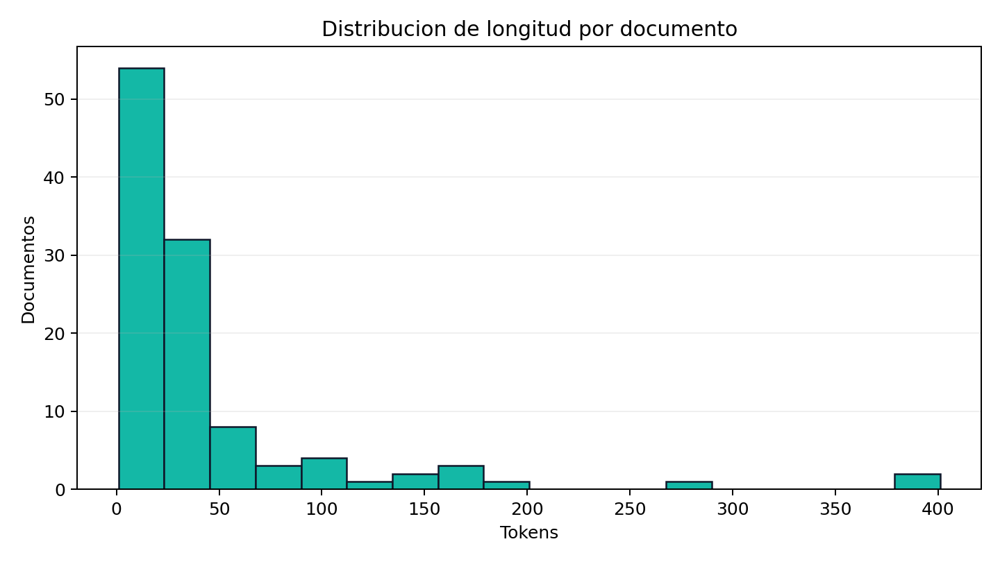
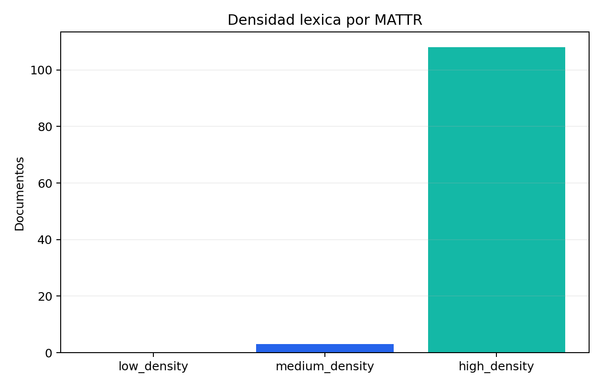
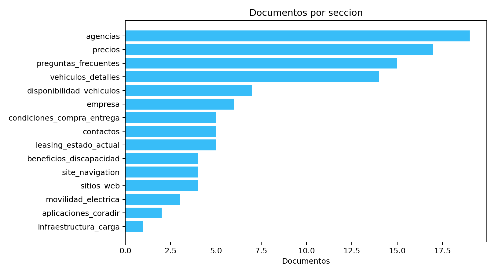

# EDA del Corpus RAG

## Resumen ejecutivo

Este reporte aplica el criterio del material de clase 4 sobre riqueza lexica y calidad de chunks al corpus usado por el chatbot. El objetivo es decidir con evidencia si conviene cambiar chunking, metadata o normalizacion antes de indexar.

## Metricas generales

- Documentos analizados: 111
- Tokens totales: 4907
- Tokens por documento: media 44.21, mediana 24, p90 105.0, maximo 401
- TTR promedio: 0.8342
- MATTR promedio: 0.8538 con ventana 50
- Documentos demasiado cortos: 67
- Documentos demasiado largos: 2
- Documentos con baja densidad lexica: 0

## Graficos

## Lectura tecnica

Hay documentos largos que pueden enviar demasiado contexto junto. Conviene revisar si deben subdividirse o enriquecerse con metadata mas especifica.

Hay documentos muy cortos. No necesariamente son malos: pueden ser utiles si contienen datos puntuales como telefonos, precios o condiciones. Deben revisarse por seccion antes de fusionarlos.

La MATTR no sugiere una necesidad inmediata de lematizacion agresiva. La mejora mas prudente es medir retrieval y enriquecer metadata antes de transformar lexicalmente el corpus.

## Top documentos a revisar

| Motivo | Seccion | Titulo | Tokens | MATTR | Fuente |
|---|---|---|---:|---:|---|
| muy largo | vehiculos_detalles | Ficha tecnica TITO | 401 | 0.8048 | `vehiculos_detalles.TITO` |
| muy largo | agencias | Agencias en Buenos Aires | 388 | 0.6575 | `distribucion.agencias_oficiales_por_provincia.Buenos Aires` |
| muy corto | empresa | empresa - fundacion | 1 | 1.0 | `empresa.fundacion` |
| muy corto | site_navigation | site navigation - current site | 2 | 1.0 | `site_navigation.current_site` |
| muy corto | leasing_estado_actual | leasing estado actual - estado | 2 | 1.0 | `leasing_estado_actual.estado` |
| muy corto | leasing_estado_actual | leasing estado actual - ultima actualizacion | 2 | 1.0 | `leasing_estado_actual.ultima_actualizacion` |
| muy corto | empresa | empresa - nombre | 3 | 1.0 | `empresa.nombre` |
| muy corto | contactos | contactos - email movilidad ventas | 4 | 1.0 | `contactos.email_movilidad_ventas` |
| muy corto | sitios_web | sitios web - principal | 5 | 1.0 | `sitios_web.principal` |
| muy corto | sitios_web | sitios web - movilidad electrica | 5 | 1.0 | `sitios_web.movilidad_electrica` |

## Decision recomendada

1. No aplicar lematizacion global todavia.
2. Priorizar metricas de retrieval con fuentes esperadas.
3. Enriquecer metadata de dominio para mejorar filtros y diagnostico.
4. Revisar manualmente documentos extremos antes de cambiar el chunking.
