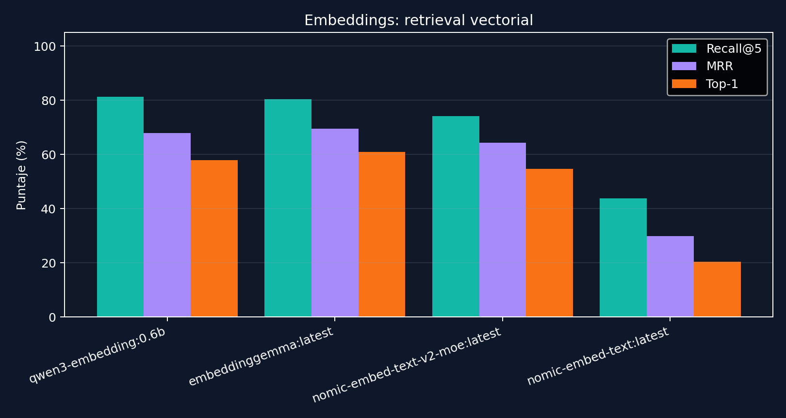

# Evaluacion de Embeddings Locales

## Objetivo

Se evaluaron los modelos de embeddings disponibles localmente para decidir si conviene mantener el embedding actual o cambiarlo por uno que recupere mejor las fuentes correctas.

La evaluacion se hizo en modo `vector`, sin respuesta generativa, para medir especificamente el componente de retrieval semantico.

## Modelos evaluados

| Embedding | Tamano local | Parametros locales | Dimensiones | Rol |
|---|---:|---:|---:|---|
| `nomic-embed-text:latest` | 274 MB | 137M | 768 | baseline liviano |
| `embeddinggemma:latest` | 621 MB | 307.58M | 768 | alternativa compacta |
| `qwen3-embedding:0.6b` | 639 MB | 595.78M | 1024 | candidato multilingue compacto |
| `nomic-embed-text-v2-moe:latest` | 957 MB | 475.29M | 768 | candidato MoE multilingue |

## Metodo

Comando ejecutado:

```bash
py -3 scripts/run_embedding_efficiency_matrix.py --cases dataset/evaluacion_rag_extendida.json --continue-on-error
```

Configuracion:

- Dataset: `dataset/evaluacion_rag_extendida.json`
- Casos: 64
- Top K: 5
- Modo de retrieval: `vector`
- Respuesta generativa: desactivada (`--skip-response`)

## Resultados

| Embedding | Precision@5 | Recall@5 | MRR | Top-1 source accuracy |
|---|---:|---:|---:|---:|
| `qwen3-embedding:0.6b` | 24.1% | 81.2% | 67.9% | 57.8% |
| `embeddinggemma:latest` | 24.4% | 80.5% | 69.5% | 60.9% |
| `nomic-embed-text-v2-moe:latest` | 20.0% | 74.2% | 64.3% | 54.7% |
| `nomic-embed-text:latest` | 13.4% | 43.8% | 29.9% | 20.3% |



## Lectura tecnica

El baseline `nomic-embed-text:latest` es el mas liviano, pero en retrieval vectorial puro quedo muy por debajo del resto. Esto explica por que la busqueda lexical y la capa extractiva son importantes en el sistema actual: compensan debilidades del ranking vectorial baseline.

Los mejores candidatos fueron:

- `embeddinggemma:latest`: mejor `MRR` y mejor `Top-1`, lo que significa que posiciona antes la fuente correcta.
- `qwen3-embedding:0.6b`: mejor `Recall@5`, lo que significa que recupera ligeramente mas fuentes esperadas dentro del top 5.

`nomic-embed-text-v2-moe:latest` mejoro mucho frente al Nomic clasico, pero no supero a `embeddinggemma` ni a `qwen3-embedding:0.6b` en esta corrida.

## Decision preliminar

Si el objetivo es reducir ruido para el LLM, `embeddinggemma:latest` es el candidato mas interesante por su mejor `Top-1` y `MRR`.

Si el objetivo es maximizar cobertura de fuentes esperadas, `qwen3-embedding:0.6b` es el candidato mas fuerte por `Recall@5`.

Recomendacion pragmatica:

1. Probar `embeddinggemma:latest` como nuevo embedding por defecto.
2. Mantener `qwen3-embedding:0.6b` como alternativa si se prioriza cobertura.
3. Repetir benchmark extendido completo con respuesta generativa usando el embedding elegido.
4. Comparar si la mejora de retrieval mejora tambien accuracy final, no solo fuentes recuperadas.

