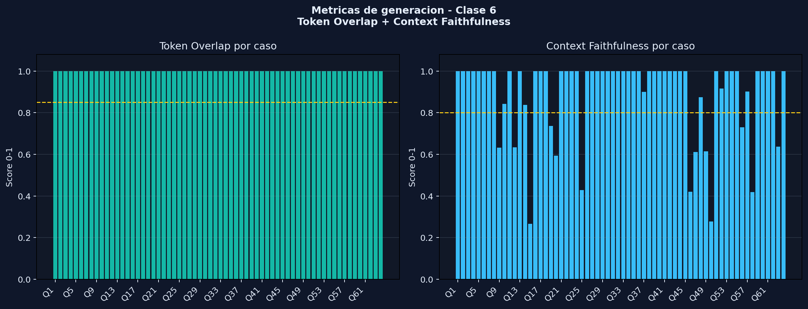

# Evaluacion de Metricas de Generacion - Clase 6

## Resumen ejecutivo

Se incorporo una evaluacion automatica inspirada en la clase 6 para medir la etapa de generacion del RAG, usando el benchmark extendido ya ejecutado. La mejora no vuelve a llamar al LLM: toma las respuestas guardadas, las keywords esperadas y el contexto recuperado para calcular dos proxies reproducibles.

- Benchmark evaluado: `docs\benchmark_extendido_strict_post_extraccion_v3.json`
- Casos evaluados: 64
- Token Overlap promedio: `1.0`
- Context Faithfulness promedio: `0.8949`
- Casos con Token Overlap alto >= 0.85: 64/64
- Casos con Context Faithfulness alto >= 0.80: 51/64

## Metodologia

### Token Overlap

Mide si la respuesta contiene los terminos esperados del caso de evaluacion. En este proyecto se calcula contra `expected_keywords`, por lo tanto funciona como proxy de correccion factual automatica.

Formula: `tokens(respuesta) & tokens(keywords esperadas) / tokens(keywords esperadas)`.

### Context Faithfulness

Mide que proporcion de los tokens significativos de la respuesta aparece en el contexto recuperado. Sirve como proxy de alucinacion o de falta de trazabilidad: si una respuesta contiene muchos terminos que no estaban en los chunks recuperados, debe revisarse.

Formula: `tokens(respuesta) & tokens(contexto recuperado) / tokens(respuesta)`.

Nota metodologica: estas metricas son automaticas y lexicales. No reemplazan una revision humana de faithfulness semantico, pero agregan una evidencia objetiva y reproducible alineada con la clase 6.

## Diagnostico por cuadrantes

| Diagnostico | Casos | Lectura |
|---|---:|---|
| Sistema OK | 51 | La respuesta contiene los terminos esperados y esta mayormente respaldada por el contexto recuperado. |
| Respuesta incompleta o retrieval incorrecto | 0 | El contexto puede ser fiel, pero la respuesta no contiene suficientes terminos esperados. |
| Posible alucinacion o contexto no trazado | 13 | La respuesta parece correcta por keywords, pero parte del texto no aparece en el contexto reconstruido. |
| Fallo total | 0 | La respuesta falla en keywords y ademas no queda respaldada por el contexto. |

## Resultado por categoria

| Categoria | Casos | Token Overlap prom. | Context Faithfulness prom. |
|---|---:|---:|---:|
| agencias | 6 | 1.0 | 0.9394 |
| app | 2 | 1.0 | 1.0 |
| beneficios | 1 | 1.0 | 0.8421 |
| carga | 4 | 1.0 | 0.763 |
| comercial | 1 | 1.0 | 0.6316 |
| compra | 5 | 1.0 | 0.894 |
| contacto | 1 | 1.0 | 0.2667 |
| empresa | 5 | 1.0 | 0.8661 |
| movilidad | 2 | 1.0 | 1.0 |
| posventa | 2 | 1.0 | 1.0 |
| precios | 12 | 1.0 | 0.8832 |
| sitios_web | 1 | 1.0 | 0.4286 |
| vehiculos | 22 | 1.0 | 0.9554 |

## Casos a revisar por menor faithfulness

| Caso | Categoria | Token Overlap | Context Faithfulness | Diagnostico | Tokens no trazados principales |
|---|---|---:|---:|---|---|
| `telefono_ventas` | contacto | 1.0 | 0.2667 | Posible alucinacion o contexto no trazado | 5264805, amplia, contactar, contamos, donde, efectuar, informacion, mas |
| `chiki_precio` | precios | 1.0 | 0.2778 | Posible alucinacion o contexto no trazado | 17.731.25, 2.900, 20.632.00, 300, aa, accesorio, aclaracion, cuesta |
| `cargas_parciales` | carga | 1.0 | 0.4186 | Posible alucinacion o contexto no trazado | 2000, 2073, 220v, 4.5, 50hz, 7hs, autonomia, chiki |
| `barre_tita_precio` | precios | 1.0 | 0.4211 | Posible alucinacion o contexto no trazado | 16.981.25, 17.731.25, 2.900, 20.632.00, 23.632.00, 5.900, accesorio, cuesta |
| `web_reservas` | sitios_web | 1.0 | 0.4286 | Posible alucinacion o contexto no trazado | 20, 200, 30, anticipo, compra, confirmacion, confirmar, dias |
| `empresa_valores` | empresa | 1.0 | 0.5938 | Posible alucinacion o contexto no trazado | atencion, competitivo, continuidad, desarrollo, especializada, fabrica, gente, oportunidad |
| `barre_tita_dimensiones_peso` | vehiculos | 1.0 | 0.6111 | Posible alucinacion o contexto no trazado | 2000x1310x350, 300, 3750x1370x1720, caja, conocida, s2, tambien |
| `barre_tita_accesorios` | vehiculos | 1.0 | 0.6154 | Posible alucinacion o contexto no trazado | cadena, carga, cerrado, compatible, convierte, frio, ideal, mayor |

## Lectura tecnica

El benchmark final mantiene la evidencia de exactitud por keywords, pero esta mejora suma una segunda lectura: que tan trazable es la respuesta respecto del contexto recuperado. Esto es importante porque un `64/64` por keywords puede ocultar respuestas con informacion adicional innecesaria, duplicaciones o terminos que no aparecen en los chunks reconstruidos.

La accion recomendada no es cambiar inmediatamente de modelo. La mejora prioritaria es usar esta tabla como control de calidad para revisar respuestas con bajo `Context Faithfulness`, ajustar la capa extractiva cuando agregue datos de mas y, si hace falta, enriquecer el reporte de benchmark para guardar el contexto textual exacto usado al responder.
