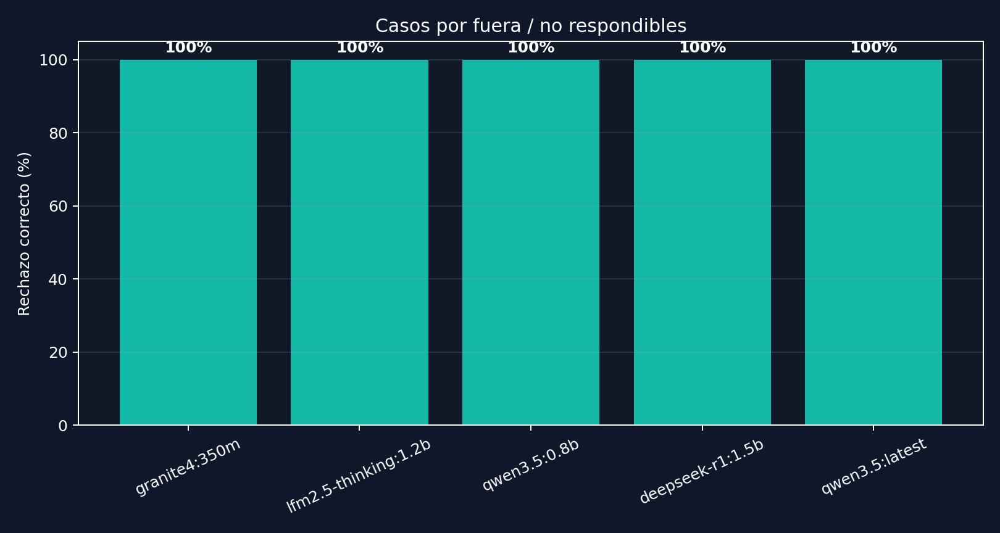

# Evaluacion de Modelos con Casos por Fuera del Corpus

## Objetivo

Se agrego una evaluacion especifica para consultas fuera de dominio o no respondibles. El objetivo es decidir si conviene usar modelos mas chicos sin aumentar el riesgo de alucinacion.

Esta evaluacion es distinta del benchmark MVP: no mide si el chatbot sabe responder preguntas frecuentes, sino si sabe limitarse cuando la base no contiene la respuesta.

## Dataset

Archivo:

- `dataset/evaluacion_no_respondibles.json`

Casos:

- resultado deportivo fuera de dominio
- receta fuera de dominio
- stock exacto actual no presente
- tasa bancaria no presente
- producto no cubierto
- articulo legal municipal no cubierto

## Hallazgo inicial

La primera corrida mostro que cambiar de modelo no resolvia por si solo el problema. La capa extractiva podia recuperar fragmentos relacionados por palabras sueltas y responder con informacion irrelevante. Ejemplos:

- una receta recuperaba informacion sobre carga domestica
- una consulta sobre stock exacto recuperaba ficha tecnica del TITO
- una consulta legal municipal recuperaba informacion de TITA

Conclusion: para casos por fuera, la mejora correcta no era solo elegir otro LLM, sino agregar un guardrail previo a la respuesta extractiva.

## Mejora implementada

Se agrego en `api/chat_service.py` una capa deterministica de guardrail antes de la respuesta extractiva:

- detecta temas claramente fuera de dominio
- detecta pedidos de datos no presentes: stock exacto actual, tasas bancarias, articulos legales municipales, camiones de larga distancia
- responde con limite de alcance antes de recuperar contexto irrelevante

Esta mejora reduce hardware porque evita llamar al LLM en consultas que pueden resolverse por regla de negocio.

## Modelos evaluados

Comando ejecutado:

```bash
py -3 scripts/run_model_efficiency_matrix.py --cases dataset/evaluacion_no_respondibles.json --output-dir docs/benchmarks_modelos_livianos_no_respondibles --models qwen3.5:latest qwen3.5:0.8b granite4:350m lfm2.5-thinking:1.2b deepseek-r1:1.5b --prompt-variant strict --continue-on-error --subprocess-timeout-seconds 180
```

## Resultados despues del guardrail

| Modelo | Casos correctos | Accuracy | Latencia promedio |
|---|---:|---:|---:|
| `qwen3.5:latest` | 6/6 | 100.0% | 0.0 s |
| `qwen3.5:0.8b` | 6/6 | 100.0% | 0.0 s |
| `granite4:350m` | 6/6 | 100.0% | 0.0 s |
| `lfm2.5-thinking:1.2b` | 6/6 | 100.0% | 0.0 s |
| `deepseek-r1:1.5b` | 6/6 | 100.0% | 0.0 s |



## Lectura tecnica

Despues de la mejora, todos los modelos empatan porque el rechazo correcto ocurre antes de llamar al modelo generativo. Esto es deseable: no conviene gastar hardware en preguntas que pueden resolverse con reglas de alcance.

La comparacion muestra que:

- el modelo de chat no es el factor principal para casos no respondibles simples
- el guardrail mejora seguridad y reduce costo
- los modelos chicos siguen siendo viables para rutas factuales porque el sistema evita que reciban consultas que no deben contestar

## Decision

Para usar menos hardware, la opcion mas defendible es:

1. mantener guardrails deterministas para fuera de dominio y datos no presentes
2. usar un modelo chico para preguntas frecuentes factuales
3. reservar `qwen3.5:latest` como fallback para consultas complejas, ambiguas o de sintesis

Con la evidencia actual, `granite4:350m`, `lfm2.5-thinking:1.2b` y `qwen3.5:0.8b` son candidatos viables para rutas factuales. La decision final deberia priorizar `qwen3.5:0.8b` si se busca equilibrio conservador, o `granite4:350m` si se busca exprimir hardware al maximo.

