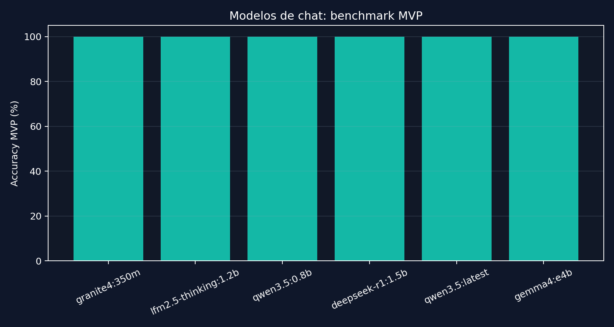
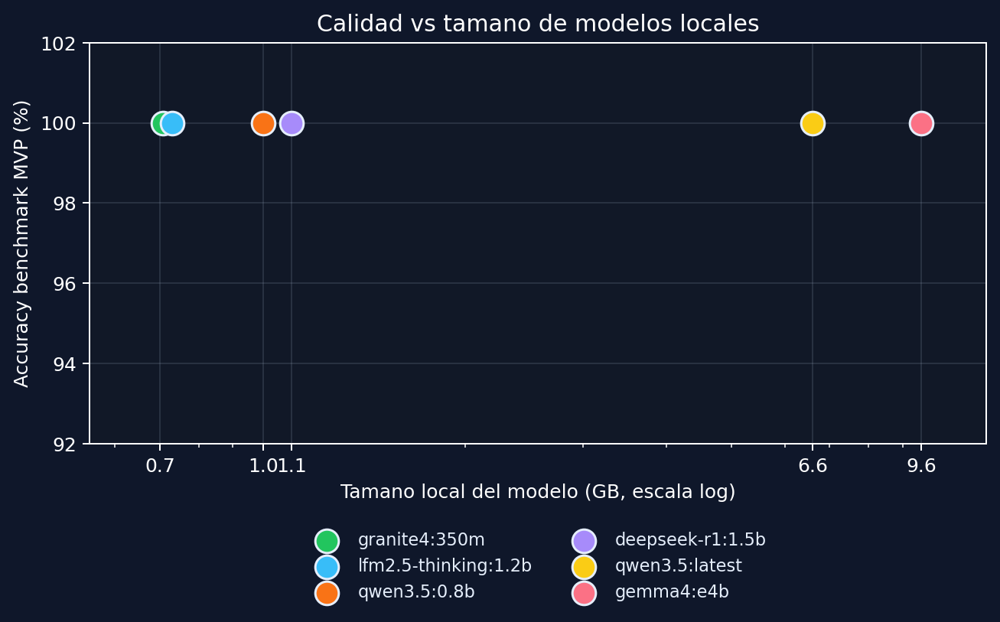

# Evaluacion de Modelos Livianos de Chat

## Objetivo

Se evaluo si el proyecto puede usar modelos de respuesta mas pequenos sin perder calidad en el benchmark MVP. La razon es optimizar hardware local: menos memoria, menor tamano descargado y potencialmente menor latencia.

## Modelos evaluados

| Modelo | Tamano local | Rol |
|---|---:|---|
| `qwen3.5:latest` | 6.6 GB | baseline |
| `qwen3.5:0.8b` | 1.0 GB | candidato chico de la misma familia |
| `deepseek-r1:1.5b` | 1.1 GB | razonamiento liviano |
| `lfm2.5-thinking:1.2b` | 731 MB | candidato sub-2B |
| `granite4:350m` | 708 MB | limite inferior instruct |
| `gemma4:e4b` | 9.6 GB | comparador alternativo, no ahorro de memoria |

## Metodo

Comando ejecutado:

```bash
py -3 scripts/run_model_efficiency_matrix.py --cases dataset/evaluacion_mvp.json --prompt-variant strict --continue-on-error
```

Dataset:

- `dataset/evaluacion_mvp.json`
- 15 preguntas frecuentes del dominio
- prompt `strict`
- embeddings `nomic-embed-text:latest`

## Resultados

| Modelo | Accuracy | Latencia promedio | Longitud media respuesta |
|---|---:|---:|---:|
| `qwen3.5:latest` | 100.0% | 0.01 s | 365.5 caracteres |
| `qwen3.5:0.8b` | 100.0% | 0.01 s | 365.5 caracteres |
| `deepseek-r1:1.5b` | 100.0% | 0.01 s | 365.5 caracteres |
| `lfm2.5-thinking:1.2b` | 100.0% | 0.01 s | 365.5 caracteres |
| `granite4:350m` | 100.0% | 0.01 s | 365.5 caracteres |
| `gemma4:e4b` | 100.0% | 0.01 s | 365.5 caracteres |





## Lectura tecnica

Todos los modelos obtuvieron el mismo resultado en el benchmark MVP. Esto no significa que todos sean igual de buenos como modelos generales. Significa que, para estas 15 preguntas frecuentes, el sistema esta resolviendo gran parte del trabajo antes de llegar al LLM:

- base cerrada y preprocesada
- busqueda de contexto
- capa extractiva para datos factuales
- prompt `strict`

La igualdad de longitud media sugiere que la ruta de respuesta fue muy similar entre modelos. Por eso esta prueba es una buena evidencia de que el MVP puede operar con modelos chicos en preguntas factuales, pero no alcanza para validar comportamiento en casos ambiguos o no respondibles.

## Decision preliminar

Para demo y preguntas frecuentes factuales, `granite4:350m`, `lfm2.5-thinking:1.2b` o `qwen3.5:0.8b` son candidatos viables para reducir hardware.

La decision conservadora seria:

- usar `qwen3.5:0.8b` como primer candidato liviano, porque conserva familia con el baseline
- probar `granite4:350m` como limite minimo si se prioriza hardware
- mantener `qwen3.5:latest` como fallback para consultas ambiguas, largas o de sintesis

Adicionalmente, se ejecuto el benchmark extendido con `qwen3.5:0.8b`:

| Modelo | Dataset | Accuracy | Latencia promedio |
|---|---|---:|---:|
| `qwen3.5:0.8b` | extendido 64 casos | 54.7% | 0.01 s |

El resultado empata con la corrida extendida documentada para `qwen3.5:latest`, por lo que `qwen3.5:0.8b` queda como recomendacion conservadora de default liviano.

## Limitacion

La evaluacion de casos por fuera mostro que cambiar de modelo no alcanzaba: hacia falta un guardrail previo a la capa extractiva. Despues de esa mejora, los modelos candidatos obtuvieron 6/6 en `dataset/evaluacion_no_respondibles.json`, con latencia promedio 0.0 s porque la respuesta se resuelve antes de llamar al LLM.

Detalle documentado en `docs/evaluacion_modelos_fuera_dominio.md`.
