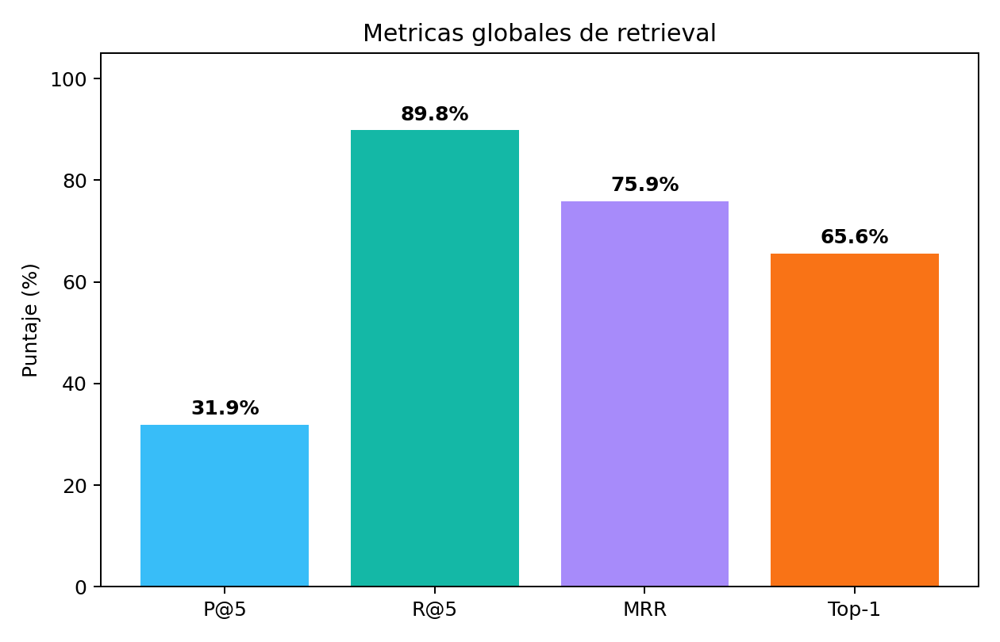
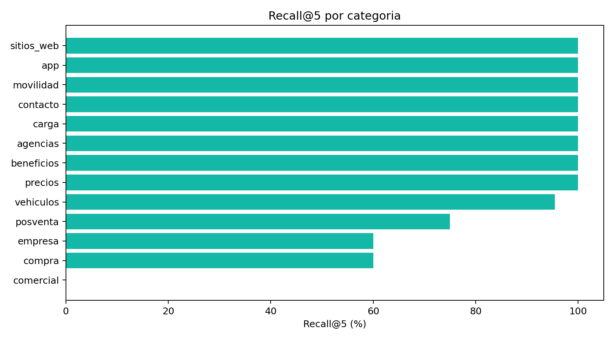

# Evaluacion de Retrieval

## Resumen ejecutivo

Se extendio `scripts/run_benchmark.py` para medir recuperacion de documentos ademas de evaluar palabras clave en la respuesta final. Esta mejora surge directamente del material de clase 4: separar fallas de retrieval de fallas de generacion.

Como Ollama no estaba disponible durante esta corrida, el reporte se ejecuto en modo `--skip-response`. Por eso no se evaluo la respuesta generada; se midio solamente el componente de retrieval con el ranking lexical del sistema.

Reporte generado:

- `docs/benchmark_extendido_retrieval_keyword_qwen35_latest.json`

## Configuracion

- Dataset: `dataset/evaluacion_rag_extendida.json`
- Casos: 64
- Campo de referencia: `expected_sources`
- Top K: 5
- Modo: retrieval-only (`--skip-response`)
- Retrieval disponible en esta corrida: busqueda lexical del sistema
- Retrieval vectorial: no ejecutado porque Ollama no estaba levantado

## Resultados globales

| Metrica | Resultado |
|---|---:|
| Precision@5 | 31.9% |
| Recall@5 | 89.8% |
| MRR | 75.9% |
| Top-1 source accuracy | 65.6% |

## Lectura tecnica

El resultado mas importante es que `Recall@5` es alto: en la mayoria de los casos, alguna fuente esperada aparece dentro de los cinco primeros documentos. Esto indica que el corpus y la busqueda lexical ya logran ubicar la evidencia en muchos casos.

La `Precision@5` es mas baja porque el top 5 incluye documentos utiles mezclados con ruido. Esto es esperable en una medicion por fuentes: si solo una fuente esperada aparece entre cinco documentos, el recall puede ser bueno pero la precision queda en 20%.

El `MRR` y el `Top-1 source accuracy` muestran el punto principal a mejorar: no basta con que la fuente correcta aparezca en el top 5; conviene que aparezca mas arriba para que el LLM reciba primero el contexto mas importante.

## Resultados por categoria

| Categoria | Casos | Precision@5 | Recall@5 | MRR | Top-1 |
|---|---:|---:|---:|---:|---:|
| agencias | 6 | 20.0% | 100.0% | 91.7% | 83.3% |
| app | 2 | 20.0% | 100.0% | 100.0% | 100.0% |
| beneficios | 1 | 20.0% | 100.0% | 100.0% | 100.0% |
| carga | 4 | 30.0% | 100.0% | 81.2% | 75.0% |
| comercial | 1 | 0.0% | 0.0% | 0.0% | 0.0% |
| compra | 5 | 16.0% | 60.0% | 60.0% | 60.0% |
| contacto | 1 | 20.0% | 100.0% | 100.0% | 100.0% |
| empresa | 5 | 16.0% | 60.0% | 50.7% | 40.0% |
| movilidad | 2 | 20.0% | 100.0% | 41.7% | 0.0% |
| posventa | 2 | 30.0% | 75.0% | 100.0% | 100.0% |
| precios | 12 | 58.3% | 100.0% | 83.3% | 66.7% |
| sitios_web | 1 | 20.0% | 100.0% | 25.0% | 0.0% |
| vehiculos | 22 | 33.6% | 95.5% | 78.2% | 68.2% |

## Casos sin fuente esperada recuperada

Los casos sin match de `expected_sources` en top 5 fueron:

- `leasing_suspendido`
- `empresa_valores`
- `modelos_discontinuados`
- `costos_no_incluidos`
- `tipo_cambio_bna`

Estos casos deben revisarse antes de cambiar el modelo. Pueden deberse a:

- fuente esperada demasiado general o mal etiquetada
- pregunta con vocabulario diferente al de la base
- documento correcto existente pero con metadata insuficiente
- dato distribuido en varias secciones
- necesidad de agregar sinonimos o metadata de dominio

## Mejora derivada

La accion recomendada no es cambiar inmediatamente el embedding, sino:

1. Completar la corrida con retrieval vectorial cuando Ollama este levantado.
2. Comparar lexical vs vectorial vs hibrido.
3. Enriquecer metadata de dominio para categorias con bajo recall.
4. Revisar `expected_sources` en los cinco casos sin match.
5. Repetir la evaluacion y comparar Precision@5, Recall@5, MRR y Top-1.

