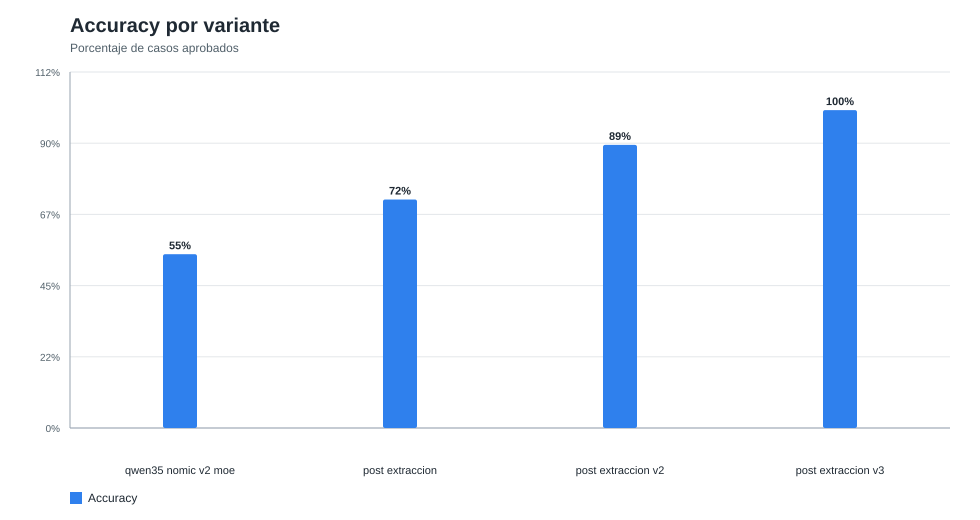
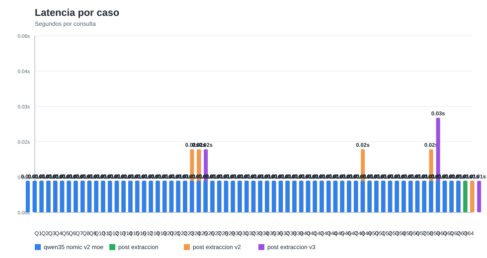
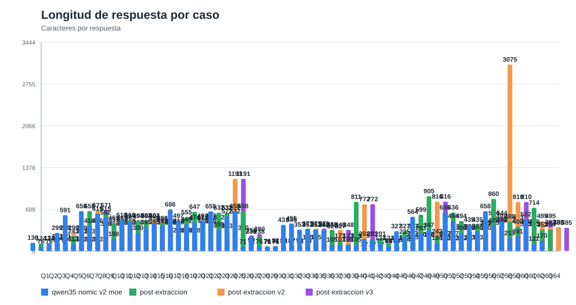
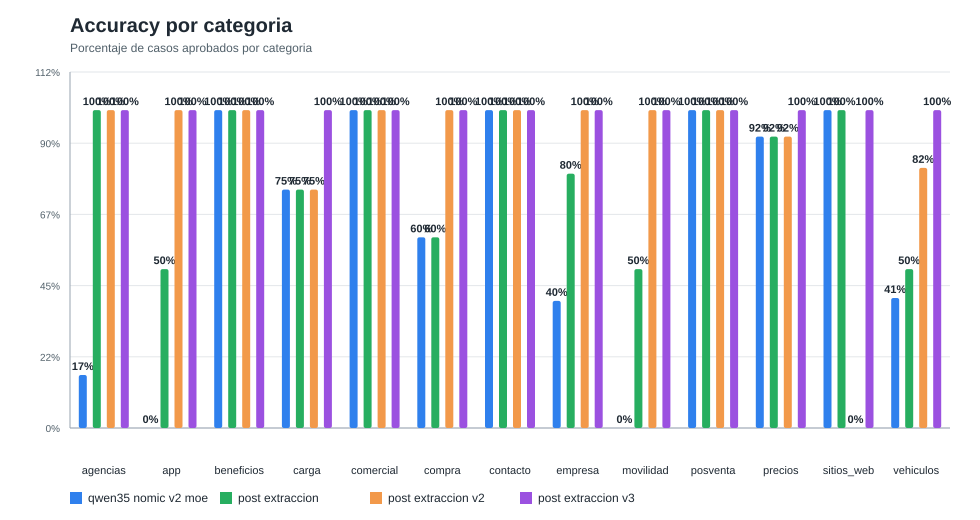
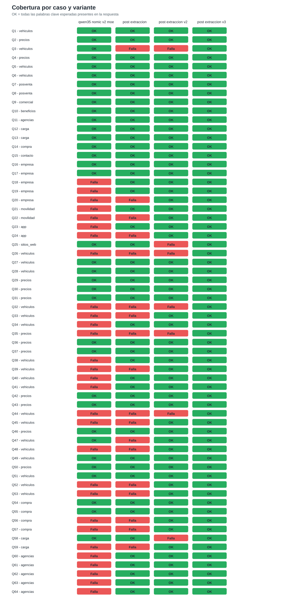

# Evaluacion Visual del Benchmark

## Resumen ejecutivo

Se generaron visualizaciones a partir de los reportes reales ejecutados localmente con Ollama. El conjunto evaluado contiene 64 casos y permite comparar cobertura, fallas y longitud de respuesta.

| Variante | Casos aprobados | Accuracy | Latencia promedio | Modelo chat | Modelo embeddings |
|---|---:|---:|---:|---|---|
| `qwen35 nomic v2 moe` | 35/64 | 54.7% | 0.01 s | `qwen3.5:latest` | `nomic-embed-text-v2-moe:latest` |
| `post extraccion` | 46/64 | 71.9% | 0.01 s | `qwen3.5:latest` | `nomic-embed-text-v2-moe:latest` |
| `post extraccion v2` | 57/64 | 89.1% | 0.01 s | `qwen3.5:latest` | `nomic-embed-text-v2-moe:latest` |
| `post extraccion v3` | 64/64 | 100.0% | 0.01 s | `qwen3.5:latest` | `nomic-embed-text-v2-moe:latest` |

## Graficos

### Accuracy por variante

### Latencia por caso

### Longitud de respuesta por caso

### Accuracy por categoria

### Cobertura por caso y variante

## Lectura rapida

- El accuracy permite comparar rapidamente la cobertura de palabras clave esperadas.
- La latencia promedio registrada por el script ayuda a controlar regresiones de performance.
- La longitud de respuesta ayuda a revisar concision: casos con respuestas mas largas deberian revisarse en la matriz factual.
- La cobertura por categoria muestra donde se concentran los aciertos y las fallas.

## Distribucion de casos

| Categoria | Casos |
|---|---:|
| agencias | 6 |
| app | 2 |
| beneficios | 1 |
| carga | 4 |
| comercial | 1 |
| compra | 5 |
| contacto | 1 |
| empresa | 5 |
| movilidad | 2 |
| posventa | 2 |
| precios | 12 |
| sitios_web | 1 |
| vehiculos | 22 |

## Limitacion

Estos graficos visualizan el benchmark actual, que valida palabras clave en la respuesta final. Las metricas de retrieval ya se registran en los JSON de benchmark; la limitacion principal restante es que el 100% corresponde a estas 64 muestras y debe validarse con preguntas nuevas para controlar sobreajuste.
